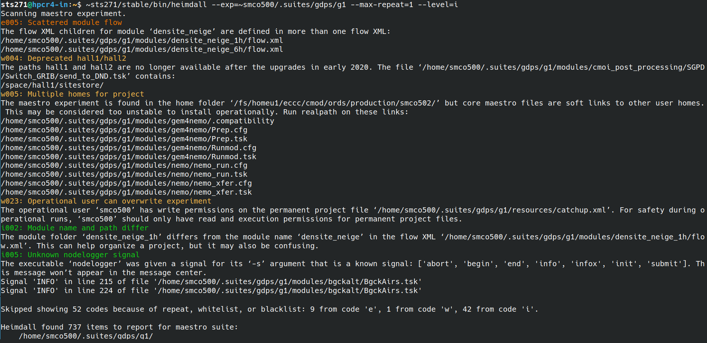

Heimdall is a maestro suite scanner. Scan for errors, warnings, recommendations, and installation issues.

What cases can Heimdall detect?

* Critical errors like: missing EntryModule, suite folders like 'listings' have bad permissions or are missing.
* Errors like: dependency does not exist, bad XML, dissemination state does not match context.
* Warnings like: unused maestro files (tsk/cfg/xml), no support status in an operational suite, deprecated paths like `hall1`.
* Info like: maestro files (tsk/cfg/xml) are links to homes outside the project, git repo has uncommited changes, unknown nodelogger signals.
* Best practices like: hard coded or absolute dependency paths, very long support info, non-maestro files in maestro file (tsk/cfg/xml) folders.

And many more! See the [tab delimited CSV](csv/message_codes.csv) for every case. Each case has an automated test.

# Screenshots



# Try it out

```
~sts271/stable/bin/heimdall --exp=~smco500/.suites/gdps/g0 --level=i --max-repeat=2

cd /home/smco500/.suites/gdps/g0/listings/eccc-ppp3/main/intxfer_g0
~sts271/stable/bin/heimdall

~sts271/stable/bin/heimdall -h
```

# Levels

Every Heimdall message has a level: critical, error, warning, info, and best practice. For example `e003` or `c001`. The levels are based on whether tools like `xflow` and `mflow` can view and run the experiment.

### Critical \(c)

Critical errors prevent the viewing or launching of the entire experiment.

### Error (e)

Errors likely prevent the viewing or launching of parts of the experiment.

### Warning (w)

A warning message explains how something is technically correct, however it may cause problems or unexpected behaviour.

### Info (i)

An info message identifies aspects of the experiment which are good to know for people with less experience with this experiment.

### Best Practice (b)

A best practice message suggests changes to the experiment so that it better follows [ISST](https://wiki.cmc.ec.gc.ca/wiki/ISST) standards and other industry standard practices.

# Project Structure

### Tests

```
cd maestro/src/python3/bin
./run_heimdall_tests
```

Every code in the [tab delimited messages CSV](csv/message_codes.csv) has at least one automated test. Suppose a new code `i999` is created. There must also be an example experiment that generates it in `maestro/src/python3/mock_files/heimdall/suites_with_codes` and optionally in `maestro/src/python3/mock_files/heimdall/suites_without_codes`. If this condition is not met, a supervisor test will fail.

### Utilities

Files in the root level of `maestro/src/python3/src/utilities` are generically useful in any Python project and can be copy pasted into new projects without modification.

### mflow

Heimdall uses components of mflow, like the `MaestroExperiment` class. Rarely, development in heimdall involves changing `mflow` dependencies. In that case, it's good to run the `mflow` tests too:

```
cd maestro/src/python3/bin
./run_mflow_tests
```


